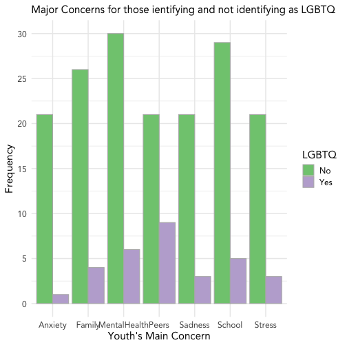

Here are some example visalizations and analyses outputs that could be relevant for the UGDSB project. Any 'Interactive' plots can only be viewed online (HTML); 'Non-interactive' plots can be exported to a PDF. 


### Histogram of Common Stressors/Major Concerns

##### Interactive


```
## Warning: Ignoring unknown parameters: binwidth, bins, pad
```

```
## PhantomJS not found. You can install it with webshot::install_phantomjs(). If it is installed, please make sure the phantomjs executable can be found via the PATH variable.
```

```
## Error in path.expand(path): invalid 'path' argument
```

##### Non-interactive 



Example of a plot marking changes over time. Here we have tracked mean impairment across a variety of domains from pre- to post-survey. 


```
## PhantomJS not found. You can install it with webshot::install_phantomjs(). If it is installed, please make sure the phantomjs executable can be found via the PATH variable.
```

```
## Error in path.expand(path): invalid 'path' argument
```

##### Non-interactive

