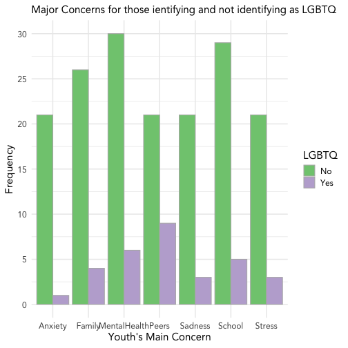
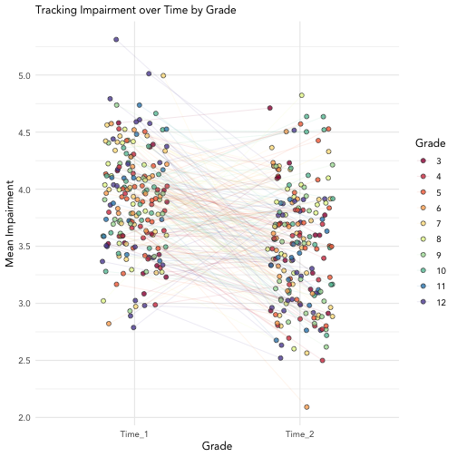

Here are some example visalizations and analyses outputs that could be relevant for the UGDSB project. Any 'Interactive' plots can only be viewed online (HTML); 'Non-interactive' plots can be exported to a PDF. 


### Histogram of Common Stressors/Major Concerns

##### Interactive


```r
hist_dat <- data.frame(Grade = sample(c(3, 4, 5, 6, 7, 8, 9, 10, 11, 12), size = 200, replace=T),
                       Sex = sample(c("Male", "Female", "Prefer not to say"), size = 200, replace=T),
                       LGBTQ = sample(c("Yes", "No"), size = 200, replace = T, prob = c(15, 85)),
                       Concern = sample(c(Cs(Stress, Sadness, Anxiety, Family, Peers, School, MentalHealth)),
                                        size = 200, replace = T)) %>% 
  mutate_if(is.character, as.factor)
plot1 <- ggplot(hist_dat, aes(Concern))+
  geom_histogram(stat="count", position = "dodge", aes(fill = LGBTQ), color = "grey71")+
    theme_minimal(15)+
  scale_y_continuous(breaks=seq(0, 100, 5))+
    labs(subtitle = "Major Concerns for those ientifying and not identifying as LGBTQ",
         x = "Youth's Main Concern", y = "Frequency")+
    scale_fill_brewer(palette = "Accent")+
    theme(text = element_text(family = "Avenir"))
```

```
## Warning: Ignoring unknown parameters: binwidth, bins, pad
```

```r
(interactive1 <- ggplotly(plot1))
```

```
## PhantomJS not found. You can install it with webshot::install_phantomjs(). If it is installed, please make sure the phantomjs executable can be found via the PATH variable.
```

```
## Error in path.expand(path): invalid 'path' argument
```

##### Non-interactive 


```r
plot1
```



Example of a plot marking changes over time. Here we have tracked mean impairment across a variety of domains from pre- to post-survey. 


```r
sp_dat <- data.frame(ID = 1:200,
                     Grade = as.factor(sample(c(3, 4, 5, 6, 7, 8, 9, 10, 11, 12), size = 200, replace=T)),
                     Time_1 = round(rnorm(200, 4, .5), 1),
                     Time_2 = round(rnorm(200, 3.5, .5), 1)) %>% 
  pivot_longer(cols = c(Cs(Time_1, Time_2)), names_to = "Time", values_to = "Impairment")

plot2 <- ggplot(sp_dat, aes(x=Time, y = Impairment))+
  geom_jitter(position = position_jitter(seed = 1, width = .2), shape = 21, size=2, aes(fill = Grade), color = "grey21", alpha=.8)+
  geom_line(aes(group=ID, color=Grade), alpha=.1, position = position_jitter(seed = 1, width = .2))+
  theme_minimal(12)+
  scale_y_continuous(breaks=seq(0,6, .5))+
  labs(subtitle = "Tracking Impairment over Time by Grade", 
       x = "Grade",
       y = "Mean Impairment")+
  scale_fill_brewer(palette = "Spectral")+
  scale_color_brewer(palette = "Spectral")+
  theme(text = element_text(family = "Avenir"))

(sp_interactive <- ggplotly(plot2))
```

```
## PhantomJS not found. You can install it with webshot::install_phantomjs(). If it is installed, please make sure the phantomjs executable can be found via the PATH variable.
```

```
## Error in path.expand(path): invalid 'path' argument
```

##### Non-interactive

```r
plot2
```



